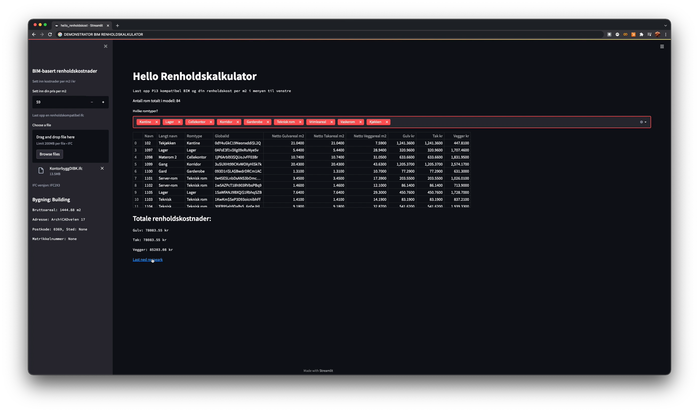

# Clean BIM PoC / BIM for Renholdskost PoC.

Proof of concept(PoC) on a cost for cleaning calculator based on BIM [in Norwegian]

[Try out the app in your browser going here](https://share.streamlit.io/mok-see/cleanbimpoc/main/hello_renholdskost.py)

## Liten prototype for å vise nytten av gode BIM krav for bruk i driftsfasen

Videoen under viser en skjermopptak av applikasjonen. Den er også bli publisert slik at den kan prøves ut med egne IFC modeller (se lenken over).

[](https://www.youtube.com/watch?v=MZTUgKKT0ac&feature=youtu.be)


## This repo also contains the code

This repo contains the code of the app, which is free and open source. Suggest using the environment.yml file to setup a local conda environment after cloning the repo.

While in the main folder you can test the app on localhost using;

```bash
$ streamlit run hello_renholdskost.py
```
